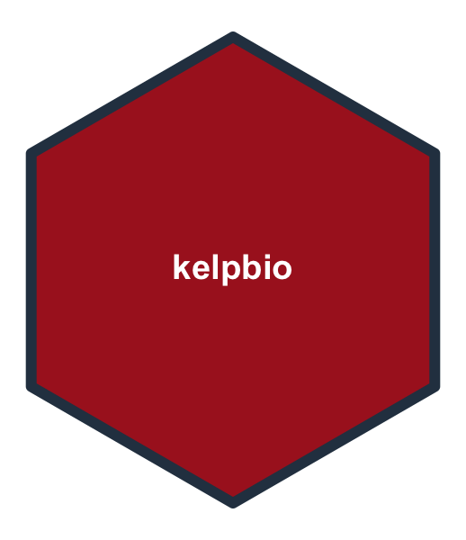

<!-- README.md is generated from README.Rmd. Please edit that file -->

```{r setup, include = FALSE}
knitr::opts_chunk$set(
  collapse = TRUE,
  comment = "#>",
  fig.path = "man/figures/README-",
  fig.width = 6,
  fig.height = 4
)
```

# kelpbio 

<!-- badges: start -->
[](https://github.com/HakaiInstitute/kelpbio/actions/workflows/R-CMD-check.yaml)
[](https://hakaiinstitute.r-universe.dev/kelpbio)
[](https://hakaiinstitute.r-universe.dev/kelpbio)
[](https://lifecycle.r-lib.org/articles/stages.html#experimental)
<!-- badges: end -->

kelpbio fits Bayesian hierarchical models to estimate kelp biomass and carbon
from field measurements.

## Installation

Install the pre-built binary from the Hakai R-universe (macOS and Windows):

``` r
install.packages(
  "kelpbio",
  repos = c("https://hakaiinstitute.r-universe.dev", getOption("repos"))
)
```

Install from source (Linux, or to build from GitHub):

``` r
# install.packages("pak")
pak::pak("HakaiInstitute/kelpbio")
```

Source builds require a C++ toolchain:

- Linux: `sudo apt install build-essential`
- Windows: [Rtools](https://cran.r-project.org/bin/windows/Rtools/)
- macOS: `xcode-select --install`

## Usage

kelpbio fits each biomass component with its own `kb_fit_*()` function. The
allometric weight model relates wet weight to sub-bulb diameter, with random
effects for site and site-by-year.

The model is fitted to a data frame of `diameter`, `weight`, `site`, and
`year`. A small simulated dataset ships with the package:

```{r data}
library(kelpbio)

head(data_weight_sim_nereo)
```

Fit the model with `kb_fit_weight_nereo()`:

```{r fit, eval = FALSE}
fit <- kb_fit_weight_nereo(data_weight_sim_nereo, seed = 1)
```

Fitting compiles and samples the Stan model, so a pre-fit model on this dataset
ships with the package for quick exploration:

```{r prefit}
fit <- fit_weight_sim_nereo
```

Check convergence with `glance()` and summarise the model terms with `tidy()`:

```{r glance}
glance(fit)

tidy(fit)
```

Predict the weight-diameter curve for each site with `kb_predict_weight_by()`
and plot it with `kb_plot_predictions()`:

```{r weight-curve}
kb_predict_weight_by(fit, by = "site") |>
  kb_plot_predictions()
```

Predict weight at new diameters with `kb_predict_weight()`. It returns a table
with a point estimate and `conf_level` compatibility limits for each row:

```{r predict}
new_data <- data.frame(diameter = c(20, 35, 50, 65, 80), site = "site1")

set.seed(1)
kb_predict_weight(fit, new_data)
```

The fitted object exposes the standard `rstantools` generics
(`posterior_predict()`, `log_lik()`, and others), so it composes directly with
`bayesplot` and `loo`.

## Citation

If you use kelpbio in your work, please cite it. Use `citation()` to get a
formatted citation and BibTeX entry:

```{r citation}
citation("kelpbio")
```

## Licensing

Copyright 2026 Tula Foundation.

The code is released under the [MIT License](LICENSE.md).
