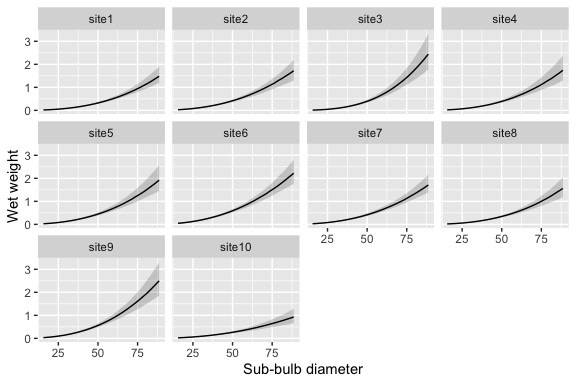

<!-- README.md is generated from README.Rmd. Please edit that file -->

# kelpbio 

<!-- badges: start -->

[](https://github.com/HakaiInstitute/kelpbio/actions/workflows/R-CMD-check.yaml)
[](https://hakaiinstitute.r-universe.dev/kelpbio)
[](https://hakaiinstitute.r-universe.dev/kelpbio)
[](https://lifecycle.r-lib.org/articles/stages.html#experimental)
<!-- badges: end -->

kelpbio fits Bayesian hierarchical models to estimate kelp biomass and
carbon from field measurements.

## Installation

Install the pre-built binary from the Hakai R-universe (macOS and
Windows):

``` r
install.packages(
  "kelpbio",
  repos = c("https://hakaiinstitute.r-universe.dev", getOption("repos"))
)
```

Install from source (Linux, or to build from GitHub):

``` r
# install.packages("pak")
pak::pak("HakaiInstitute/kelpbio")
```

Source builds require a C++ toolchain:

- Linux: `sudo apt install build-essential`
- Windows: [Rtools](https://cran.r-project.org/bin/windows/Rtools/)
- macOS: `xcode-select --install`

## Usage

kelpbio fits each biomass component with its own `kb_fit_*()` function.
The allometric weight model relates wet weight to sub-bulb diameter,
with random effects for site and site-by-year.

The model is fitted to a data frame of `diameter`, `weight`, `site`, and
`year`. A small simulated dataset is included with the package:

``` r
library(kelpbio)

head(data_weight_sim_nereo)
#> # A tibble: 6 × 4
#>   diameter weight site  year 
#>      <dbl>  <dbl> <fct> <fct>
#> 1     53.8  0.412 site1 2019 
#> 2     38.2  0.183 site1 2019 
#> 3     25.2  0.059 site1 2019 
#> 4     54.5  0.523 site1 2019 
#> 5     25.6  0.06  site1 2019 
#> 6     49.5  0.411 site1 2019
```

Fit the model with `kb_fit_weight_nereo()`:

``` r
fit <- kb_fit_weight_nereo(data_weight_sim_nereo, seed = 1)
```

Fitting compiles and samples the Stan model, so a pre-fit model on this
dataset is included with the package for quick exploration:

``` r
fit <- fit_weight_sim_nereo
```

Check convergence with `glance()` and summarise the model terms with
`tidy()`:

``` r
glance(fit)
#> # A tibble: 1 × 9
#>       n     K nchains niters nthin   ess  rhat perc_divergent converged
#>   <int> <int>   <int>  <dbl> <int> <dbl> <dbl>          <dbl> <lgl>    
#> 1   234    10       2    500    10  591.  1.01              0 TRUE

tidy(fit)
#> # A tibble: 7 × 4
#>   term          estimate  lower  upper
#>   <chr>            <dbl>  <dbl>  <dbl>
#> 1 bWeight        -1.46   -1.65  -1.25 
#> 2 bDiameter       2.51    2.25   2.75 
#> 3 bDiameter2      0.0702 -0.161  0.318
#> 4 sSite           0.28    0.172  0.504
#> 5 sSiteDiameter   0.317   0.169  0.62 
#> 6 sSiteYear       0.0957  0.054  0.147
#> 7 sWeight         0.161   0.141  0.184
```

Predict the weight-diameter curve for each site with
`kb_predict_weight_by()` and plot it with `kb_plot_predictions()`:

``` r
kb_predict_weight_by(fit, by = "site") |>
  kb_plot_predictions()
```

<!-- -->

Predict weight at new diameters with `kb_predict_weight()`. It returns a
table with a point estimate and `conf_level` compatibility limits for
each row:

``` r
new_data <- data.frame(diameter = c(20, 35, 50, 65, 80), site = "site1")

set.seed(1)
kb_predict_weight(fit, new_data)
#> <kb_predictions> predictor: diameter | response: weight | by: site
#> # A tibble: 5 × 5
#>   diameter site  estimate  lower  upper
#>      <dbl> <chr>    <dbl>  <dbl>  <dbl>
#> 1       20 site1   0.0301 0.0226 0.0393
#> 2       35 site1   0.126  0.0988 0.161 
#> 3       50 site1   0.32   0.251  0.41  
#> 4       65 site1   0.643  0.498  0.854 
#> 5       80 site1   1.12   0.853  1.5
```

The fitted object exposes the standard `rstantools` generics
(`posterior_predict()`, `log_lik()`, and others), so it composes
directly with `bayesplot` and `loo`.

## Citation

If you use kelpbio in your work, please cite it. Use `citation()` to get
a formatted citation and BibTeX entry:

``` r
citation("kelpbio")
#> To cite kelpbio in publications use:
#> 
#>   Dalgarno S (2026). _kelpbio: Bayesian Kelp Biomass Estimation_. R
#>   package version 0.0.0.9000,
#>   <https://github.com/HakaiInstitute/kelpbio>.
#> 
#> A BibTeX entry for LaTeX users is
#> 
#>   @Manual{,
#>     title = {kelpbio: Bayesian Kelp Biomass Estimation},
#>     author = {Seb Dalgarno},
#>     year = {2026},
#>     note = {R package version 0.0.0.9000},
#>     url = {https://github.com/HakaiInstitute/kelpbio},
#>   }
```

## Licensing

Copyright 2026 Tula Foundation.

The code is released under the [MIT License](LICENSE.md).
