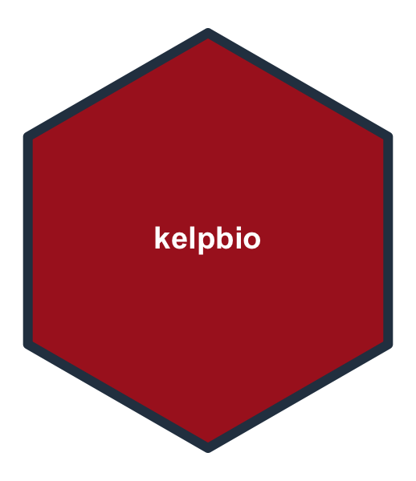
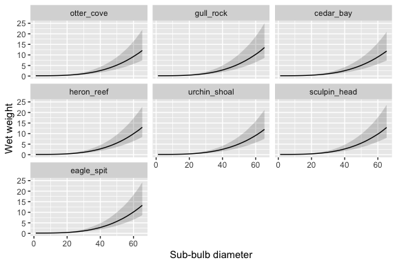

<!-- README.md is generated from README.Rmd. Please edit that file -->

# kelpbio 

<!-- badges: start -->

[](https://github.com/HakaiInstitute/kelpbio/actions/workflows/R-CMD-check.yaml)
[](https://hakaiinstitute.r-universe.dev/kelpbio)
[](https://hakaiinstitute.r-universe.dev/kelpbio)
[](https://lifecycle.r-lib.org/articles/stages.html#experimental)
<!-- badges: end -->

kelpbio fits Bayesian hierarchical models to estimate kelp biomass and
carbon from field measurements.

## Installation

Install the pre-built binary from the Hakai R-universe (macOS and
Windows):

``` r
install.packages(
  "kelpbio",
  repos = c("https://hakaiinstitute.r-universe.dev", getOption("repos"))
)
```

Install from source (Linux, or to build from GitHub):

``` r
# install.packages("pak")
pak::pak("HakaiInstitute/kelpbio")
```

Source builds require a C++ toolchain:

- Linux: `sudo apt install build-essential`
- Windows: [Rtools](https://cran.r-project.org/bin/windows/Rtools/)
- macOS: `xcode-select --install`

## Usage

kelpbio fits each biomass component with its own `kb_fit_*()` function.
The allometric weight model relates wet weight to sub-bulb diameter,
with random effects for year, site, and site-by-year.

The model is fitted to a data frame of `diameter_mm`, `weight_kg`,
`site`, and `year`, with an optional site-year stipe density,
`stipes_m2`. A small simulated dataset is included with the package:

``` r
library(kelpbio)

head(data_weight_sim_nereo)
#> # A tibble: 6 × 5
#>   diameter_mm weight_kg site       year  stipes_m2
#>         <dbl>     <dbl> <fct>      <fct>     <dbl>
#> 1        26.6     0.661 otter_cove 2019       0.37
#> 2        11.8     0.134 otter_cove 2019       0.37
#> 3        22.8     0.715 otter_cove 2019       0.37
#> 4        37.1     1.94  otter_cove 2019       0.37
#> 5        36.5     1.52  otter_cove 2019       0.37
#> 6        25.9     0.271 otter_cove 2019       0.37
```

Fit the model with `kb_fit_weight_nereo()`:

``` r
fit <- kb_fit_weight_nereo(data_weight_sim_nereo, seed = 1)
```

Fitting compiles and samples the Stan model, so a pre-fit model on this
dataset is included with the package for quick exploration:

``` r
fit <- fit_weight_sim_nereo
```

Check convergence with `glance()` and summarise the model terms with
`tidy()`:

``` r
glance(fit)
#> # A tibble: 1 × 9
#>       n     K nchains niters nthin   ess  rhat perc_divergent converged
#>   <int> <int>   <int>  <dbl> <int> <dbl> <dbl>          <dbl> <lgl>    
#> 1   420    11       3    500     2  641.  1.00              0 TRUE

tidy(fit)
#> # A tibble: 8 × 4
#>   term      estimate    lower  upper
#>   <chr>        <dbl>    <dbl>  <dbl>
#> 1 bWeight    -1.02   -1.49    -0.498
#> 2 bPower      3.25    3.02     3.5  
#> 3 bFloor      0.125   0.107    0.144
#> 4 bDensity   -0.0528 -0.219    0.107
#> 5 sSite       0.106   0.00442  0.385
#> 6 sYear       0.326   0.0889   1.02 
#> 7 sSiteYear   0.246   0.131    0.426
#> 8 sWeight     0.449   0.421    0.485
```

Predict the weight-diameter curve for each site at a grid from
`kb_new_data()` and plot it with `kb_plot_predictions()`:

``` r
kb_predict_weight(fit, kb_new_data(fit, by = "site")) |>
  kb_plot_predictions()
```

<!-- -->

Predict weight at new diameters with `kb_predict_weight()`. It returns a
table with a point estimate and `conf_level` compatibility limits for
each row:

``` r
new_data <- data.frame(diameter_mm = c(20, 35, 50, 65, 80), site = "otter_cove")

set.seed(1)
kb_predict_weight(fit, new_data)
#> <kb_predictions> predictor: diameter_mm | response: weight_kg | by: site
#> # A tibble: 5 × 5
#>   diameter_mm site       estimate  lower  upper
#>         <dbl> <chr>         <dbl>  <dbl>  <dbl>
#> 1          20 otter_cove    0.398  0.295  0.582
#> 2          35 otter_cove    1.73   1.12   2.85 
#> 3          50 otter_cove    5.18   3.25   8.94 
#> 4          65 otter_cove   11.9    7.32  21.6  
#> 5          80 otter_cove   23.3   13.9   43.2
```

The fitted object exposes the standard `rstantools` generics
(`posterior_predict()`, `log_lik()`, and others), so it composes
directly with `bayesplot` and `loo`.

## Citation

If you use kelpbio in your work, please cite it. Use `citation()` to get
a formatted citation and BibTeX entry:

``` r
citation("kelpbio")
#> To cite kelpbio in publications use:
#> 
#>   Dalgarno S (2026). _kelpbio: Bayesian Kelp Biomass Estimation_. R
#>   package version 0.0.0.9000,
#>   <https://github.com/HakaiInstitute/kelpbio>.
#> 
#> A BibTeX entry for LaTeX users is
#> 
#>   @Manual{,
#>     title = {kelpbio: Bayesian Kelp Biomass Estimation},
#>     author = {Seb Dalgarno},
#>     year = {2026},
#>     note = {R package version 0.0.0.9000},
#>     url = {https://github.com/HakaiInstitute/kelpbio},
#>   }
```

## Licensing

Copyright 2026 Tula Foundation.

The code is released under the [MIT License](LICENSE.md).
