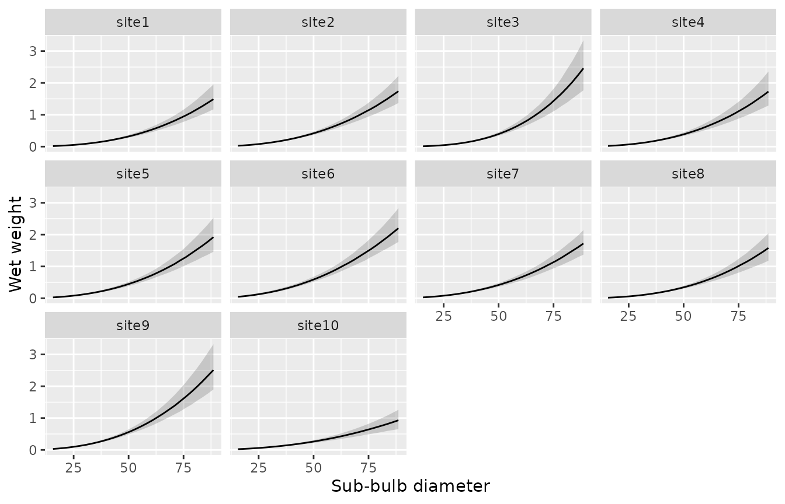

# Get started with kelpbio

``` r

library(kelpbio)
```

kelpbio fits Bayesian hierarchical Stan models to estimate kelp biomass
from field measurements. This article walks through the allometric
weight model for *Nereocystis luetkeana*, which relates wet weight to
sub-bulb diameter with random effects for site and site-by-year. Further
biomass components (plant size distribution, density, and wet-to-dry and
carbon tissue conversions) are in development.

Under the hood, models are fitted with
[rstan](https://mc-stan.org/rstan/). The Stan code is pre-compiled when
the package is installed, so no separate Stan installation is required.

## Providing data

The weight model is fitted to a data frame with a numeric `diameter`, a
numeric `weight`, and `site` and `year` grouping factors. A small
simulated dataset is included with the package:

``` r

data_weight_sim_nereo
#> # A tibble: 234 × 4
#>    diameter weight site  year 
#>       <dbl>  <dbl> <fct> <fct>
#>  1     53.8  0.412 site1 2019 
#>  2     38.2  0.183 site1 2019 
#>  3     25.2  0.059 site1 2019 
#>  4     54.5  0.523 site1 2019 
#>  5     25.6  0.06  site1 2019 
#>  6     49.5  0.411 site1 2019 
#>  7     63.7  0.693 site2 2019 
#>  8     32.6  0.144 site2 2019 
#>  9     44.5  0.166 site2 2019 
#> 10     58    0.457 site2 2019 
#> # ℹ 224 more rows
```

[`kb_check_data_weight_nereo()`](https://hakaiinstitute.github.io/kelpbio/reference/kb_check_data_weight_nereo.md)
confirms the data are in the expected format, returning the data
invisibly if the checks pass and raising an informative error otherwise:

``` r

kb_check_data_weight_nereo(data_weight_sim_nereo)
```

## Fitting the model

[`kb_fit_weight_nereo()`](https://hakaiinstitute.github.io/kelpbio/reference/kb_fit_weight_nereo.md)
fits the model. Set `progress = "none"` to silence the sampler’s console
output, and `seed` for a reproducible fit.

``` r

fit <- kb_fit_weight_nereo(
  data_weight_sim_nereo,
  chains = 2,
  niters = 400,
  seed = 42
)
```

The short run above keeps the example quick; for a real analysis use the
defaults (`chains = 4`, `niters = 1000`) or more.

## Checking convergence

[`glance()`](https://generics.r-lib.org/reference/glance.html) returns a
one-row summary of the fit, including the sampler settings and the
convergence diagnostics. `converged` is `TRUE` when the split R-hat is
below its threshold (1.05 by default) and the effective sample size is
adequate.

``` r

glance(fit)
#> # A tibble: 1 × 8
#>       n     K nchains niters nthin   ess  rhat converged
#>   <int> <int>   <int>  <dbl> <int> <dbl> <dbl> <lgl>    
#> 1   234    10       2    400     1  201.  1.03 TRUE
```

## Summarising the fit

[`tidy()`](https://generics.r-lib.org/reference/tidy.html) returns the
model terms with a point estimate and compatibility limits. The
intercept and slopes describe the allometric relationship on the log
scale; the `s`-prefixed terms are the random-effect standard deviations.

``` r

tidy(fit)
#> # A tibble: 7 × 4
#>   term          estimate   lower  upper
#>   <chr>            <dbl>   <dbl>  <dbl>
#> 1 bWeight        -1.47   -1.66   -1.24 
#> 2 bDiameter       2.5     2.28    2.74 
#> 3 bDiameter2      0.0749 -0.156   0.313
#> 4 sSite           0.27    0.176   0.459
#> 5 sSiteDiameter   0.313   0.169   0.62 
#> 6 sSiteYear       0.0962  0.0521  0.149
#> 7 sWeight         0.161   0.141   0.185
```

## Priors

[`kb_priors_weight_nereo()`](https://hakaiinstitute.github.io/kelpbio/reference/kb_priors_weight_nereo.md)
returns the default priors, which are weakly informative on the model’s
centered log scale.

``` r

kb_priors_weight_nereo()
#> $intercept
#> normal(mean = 0, sd = 2)
#> 
#> $diameter
#> normal(mean = 2, sd = 1)
#> 
#> $diameter2
#> normal(mean = 0, sd = 0.5)
#> 
#> $sd_site
#> exponential(rate = 1)
#> 
#> $sd_site_diameter
#> exponential(rate = 1)
#> 
#> $sd_site_year
#> exponential(rate = 1)
#> 
#> $sd_residual
#> exponential(rate = 1)
```

Adjust a prior by replacing an element with
[`kb_prior_normal()`](https://hakaiinstitute.github.io/kelpbio/reference/kb_prior_normal.md)
or
[`kb_prior_exponential()`](https://hakaiinstitute.github.io/kelpbio/reference/kb_prior_exponential.md)
and passing the result to the `priors` argument of
[`kb_fit_weight_nereo()`](https://hakaiinstitute.github.io/kelpbio/reference/kb_fit_weight_nereo.md):

``` r

priors <- kb_priors_weight_nereo()
priors$sd_site <- kb_prior_exponential(2)
fit <- kb_fit_weight_nereo(data_weight_sim_nereo, priors = priors, seed = 1)
```

## Predictions

[`kb_predict_weight_by()`](https://hakaiinstitute.github.io/kelpbio/reference/kb_predict_weight_by.md)
summarises the fitted weight-diameter curve over a generated diameter
sequence, one curve per group named in `by`. Pass the result to
[`kb_plot_predictions()`](https://hakaiinstitute.github.io/kelpbio/reference/kb_plot_predictions.md)
to plot the curve with its compatibility band:

``` r

kb_predict_weight_by(fit, by = "site") |>
  kb_plot_predictions()
```



[`kb_predict_weight()`](https://hakaiinstitute.github.io/kelpbio/reference/kb_predict_weight.md)
instead predicts at the rows of a supplied data frame, returning a point
estimate and compatibility limits for each row:

``` r

new_data <- data.frame(diameter = c(20, 35, 50, 65, 80), site = "site1")
kb_predict_weight(fit, new_data)
#> <kb_predictions> predictor: diameter | response: weight | by: site
#> # A tibble: 5 × 5
#>   diameter site  estimate  lower  upper
#>      <dbl> <chr>    <dbl>  <dbl>  <dbl>
#> 1       20 site1   0.0302 0.0233 0.0396
#> 2       35 site1   0.125  0.0992 0.155 
#> 3       50 site1   0.321  0.25   0.405 
#> 4       65 site1   0.647  0.501  0.857 
#> 5       80 site1   1.12   0.86   1.51
```

## Standard Bayesian tooling

The fitted object exposes the `rstantools` generics, so it composes
directly with `bayesplot` and `loo`. A posterior-predictive check uses
the stored `yrep` via
[`posterior_predict()`](https://mc-stan.org/rstantools/reference/posterior_predict.html):

``` r

bayesplot::ppc_dens_overlay(
  y = fit$data$weight,
  yrep = posterior_predict(fit)
)
```

Leave-one-out cross-validation uses the pointwise
[`log_lik()`](https://mc-stan.org/rstantools/reference/log_lik.html):

``` r

loo::loo(log_lik(fit))
```
