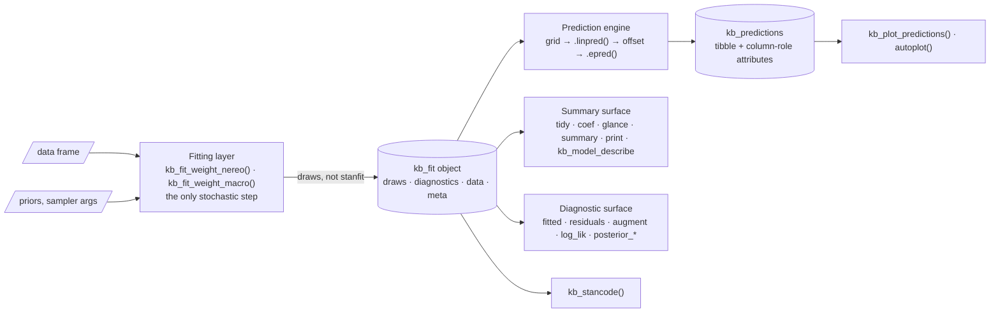
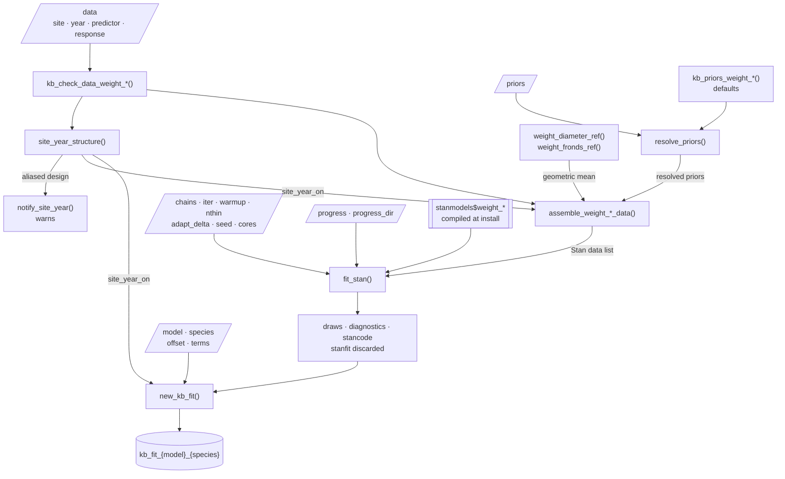
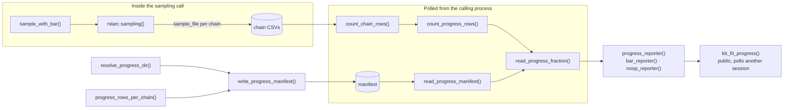
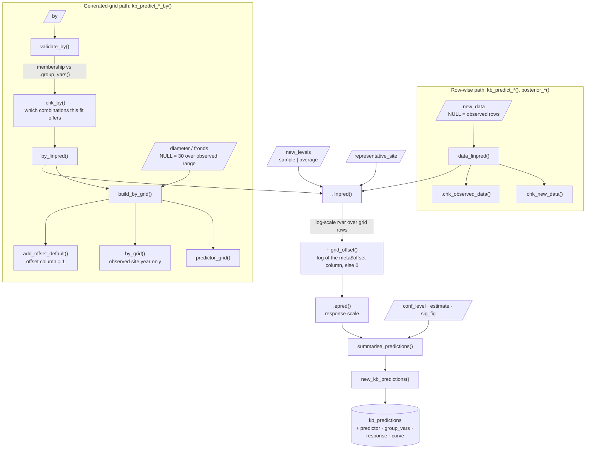
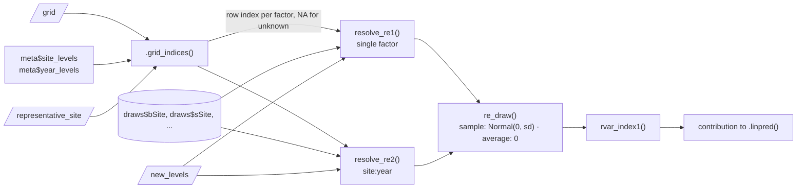
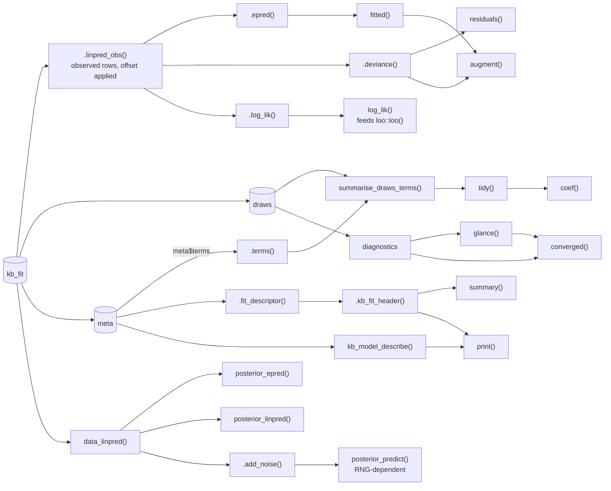

# kelpbio Architecture

> Scope: the package as it stands on the `generalize-prediction-engine` branch. Two models are implemented end to end: the *Nereocystis luetkeana* and *Macrocystis pyrifera* allometric weight models. This document describes the architecture that model establishes and that every later model will reuse. The behavioural contract lives in `openspec/specs/`; the rationale behind the choices below lives in the other files in `decisions/`. Read those for authority; read this for the map.

## Overview

kelpbio fits Bayesian hierarchical kelp-biomass models with Stan and exposes them through a small S3 surface built on the tidyverse/`posterior` stack. The engine is `rstan` + `rstantools`: Stan sources in `inst/stan/` are transpiled to C++ and compiled into the package binary at `R CMD INSTALL` time, so users never need `cmdstanr` or a separate Stan toolchain. See `decisions/engine-choice.md`.

The package is designed around one organising decision: a fit object stores **extracted posterior draws, not the live `stanfit`**. Fitting is the only stochastic step; everything downstream (summaries, diagnostics, predictions, plots) is pure `posterior` arithmetic over stored draws. This makes fit objects small, portable, robust across rstan versions, and makes a pre-fit model a non-special case (the bundled `fit_weight_sim_nereo` is just a fit object). See `decisions/prediction-engine.md` and the `fitting` spec.

The eventual package composes six sub-models (weight, size, density, blade fraction, wet/dry, carbon) into a biomass estimate by size-integration. On this branch only the weight model exists; the other five and the biomass composition are out of scope. The architecture here is deliberately the template the rest will follow.

## Architecture Diagrams

Six diagrams, coarse to fine. This one is the map; the other five sit in the
sections that own them. Rounded boxes are functions, cylinders are objects, parallelograms
are user-supplied arguments, and edge labels name what crosses.

Everything to the right of the fit object is pure `posterior` arithmetic over
stored draws: deterministic, fast, and independent of rstan. That boundary is the
single most load-bearing decision in the package, and the diagrams below are
mostly about what happens on its right-hand side.

| Diagram | Where | Answers |
|---------------------------|-------------------------|--------------------------|
| Fit path | Fitting Layer | How a data frame becomes a fit object, and which arguments reach where |
| Progress reporting | Fitting Layer | The one subsystem that is large relative to its job |
| Prediction engine | The Prediction Engine | How a grid becomes a summary, and where the offset enters |
| Random-effect resolution | The Prediction Engine | What `new_levels` and `representative_site` actually switch |
| Read surface | Summary and Diagnostic Surface | Which internal each public verb routes through |

## The Stan Engine

**Purpose**: define the likelihood and priors; compile to a callable model object.

**Location**: `inst/stan/weight_nereo.stan`, surfaced as `stanmodels$weight_nereo` (`R/stanmodels.R`, generated).

**Why rstan / rstantools, pre-compiled.** kelpbio uses the `rstan` + `rstantools` backend so the Stan models are transpiled to C++ and compiled once when the package is installed, not when a user fits. Fitting is then an ordinary function call against the ready binary: no cmdstan toolchain, no C++ compiler invoked at runtime, and no minutes-long per-model compile. Users get a package that installs like any other and runs immediately. Because the model is fixed at compile time, everything a user might want to vary (the prior hyperparameters and the structural flags below) is passed in through the Stan `data` block rather than by editing and recompiling source, so the single compiled binary serves every prior choice and structural variant. See `decisions/engine-choice.md`.

The model is the validated analysis-project allometry adapted to site-year resolution (no month dimension). `log(weight)` follows a Student-t (df fixed at 4) with mean

- intercept + linear + quadratic terms in centered log-diameter,
- a site random intercept and a site random slope on log-diameter,
- a site:year random intercept.

Engine conventions visible in the source (see `openspec/config.yaml` `context:` for the cross-cutting rules):

- **Priors as data.** Every prior hyperparameter is a `data`-block input (`prior_intercept_mu`, `prior_sd_site_rate`, and so on), so users adjust priors through R without recompiling. The prior *family* is fixed at compile time (Normal for location terms, Exponential for SDs).
- **Non-centered parameterization.** `z_*` standard-normal parameters scaled by the group SD in `transformed parameters` (`z_bSite` -\> `bSite`, etc.).
- **Structural flags as data.** `prior_only` skips the likelihood (sample from priors); `site_year_on` zeroes the site:year term. Both let one compiled model serve several structural variants. `site_year_on` is not a user argument: the fitting layer derives it from the data (dropped only when fewer than two years are present, kept otherwise, with a warning when the design is aliased); see the fitting layer and `openspec/specs/fitting`.
- **`nObs == 0` supported** for prior-only / empty fits; likelihood and generated- quantity loops are no-ops.
- **Log-diameter centered at `diameter_ref`** (a data input; the geometric mean of observed diameter). Centering in log space makes the diameter unit immaterial, so the fit and predictions are scale-invariant and the data columns keep plain names.
- **Mean is a model-block local** (`log_eWeight`), computed only when the likelihood is evaluated, so rstan does not save it with the draws. There are no `generated quantities`: the pointwise `log_lik` (for `loo`) and the `yrep` replicates (for `pp_check`) are recomputed in R from the stored draws, as are predictions at new data. Storing them scaled as `2 x nObs x ndraws` and dominated every fit object.

Because `devtools::load_all()` does not re-transpile Stan, any `.stan` edit requires `rstantools::rstan_config()` then `devtools::install()`. See `CLAUDE.md`.

## Fitting Layer

**Purpose**: turn a data frame into a fit object; isolate the one stochastic step.

**Entry point**: `kb_fit_weight_nereo()` in `R/kb_fit_weight_nereo.R`.

The fit function is deliberately a thin orchestrator over pure helpers plus one sampling call, so almost all logic is unit-testable without MCMC (see Testability):

1.  `.chk_sampler_args()` / `kb_check_data_weight_nereo()` validate arguments and data.
2.  `resolve_priors(priors, kb_priors_weight_nereo())` merges user priors over defaults (`R/resolve_priors.R`): `NULL` returns defaults; supplied names must be a subset of the defaults; each entry must match the default's family (family is fixed).
3.  `assemble_weight_nereo_data()` maps validated data plus the resolved prior list to the Stan `data` block (`R/assemble_weight_nereo_data.R`): factor-codes `site`/`year` to integers, passes raw `diameter`/`weight` (Stan applies the log transforms), computes `diameter_ref` via `weight_diameter_ref()`.
4.  `fit_stan()` (`R/fit_stan.R`) is the model- and species-agnostic sampling engine shared by every future `kb_fit_*`: it calls `rstan::sampling()` once, extracts draws with `posterior::as_draws_rvars()`, subsets the requested parameters (dropping `lp__` and the `z_*` non-centered parameters), summarises convergence (Rhat, bulk/tail ESS, divergences), captures the Stan source, and lets the `stanfit` go out of scope.
5.  `new_kb_fit()` assembles the fit object and its metadata. It is shared by every sub-model: `model` and `species` build the three class tiers, and the model is deliberately not copied into `meta`, since the class already carries it.

**Sampler conventions** (all in `kb_fit_weight_nereo()` / `fit_stan()`):

- `niters` means *saved post-warmup draws per chain*. `fit_stan()` sets `warmup = niters` and `iter = warmup + niters * nthin`, so the argument does not collide with rstan's own `iter` semantics.
- `adapt_delta = 0.95` by default (above Stan's 0.8, for the hierarchical geometry), merged with any user `control` list passed through `...` so it stays overridable.
- `quiet = FALSE` shows sampling progress and rstan's full HMC diagnostics; `quiet = TRUE` muffles the post-sampling diagnostic warnings locally via `with_quiet_sampler()` (a `withCallingHandlers`), never a global option.
- `resolve_cores()` respects `getOption("mc.cores")`, falling back to `chains`, capped at available cores so the default never oversubscribes.

**The fit object**. `new_kb_fit()` returns `class = c("kb_fit_<model>_<species>", "kb_fit_<model>", "kb_fit")` with:

| Slot | Contents |
|---------------------------|---------------------------------------------|
| `draws` | `posterior` `draws_rvars` of the model parameters (fixed effects, SDs, and the per-level `bSite`/`bSiteDiameter`/`bSiteYear`, kept so predictions and `augment` can condition on observed levels). |
| `diagnostics` | `summary` (per-variable Rhat/ESS) plus the run-level `ndivergent`, `perc_divergent`, `perc_max_treedepth` and `ebfmi`, as plain numerics. Computed while the `stanfit` is in scope, since none can be recovered from the stored draws. |
| `data` | the validated input data frame. |
| `meta` | `species`, `prior_only`, `priors`, `stancode`, `site_levels`, `year_levels`, `nthin`, `offset`, `terms`, `predictor`, `response`, `predictor_ref`, `site_year_on` (auto-derived from the data), `nu`. |

Each species is a subclass of the model class (`c("kb_fit_weight_<species>", "kb_fit_weight", "kb_fit")`); each public method body lives at the highest class tier at which it is invariant -- `kb_fit` for all of them but `predict` -- while whatever varies is an internal generic registered at the model tier (`.epred.kb_fit_weight`) or the leaf (`.linpred.kb_fit_weight_nereo`), so no method branches on `meta$species` (kept for display, with species-specific values entering through `meta_extra`). See `decisions/species-as-variant.md`.

`kb_fit_weight_nereo()` and `kb_fit_weight_macro()` are the two widest functions in
the package (10 internal calls each), which is what a thin orchestrator over pure
helpers looks like: every box above is separately testable without MCMC, and the
fit function only wires them together.

`offset` and `terms` are declarations the fit function makes about its own model,
passed as required arguments so a sub-model cannot omit them. See
[Meta Versus Dispatch](#meta-versus-dispatch).

### Progress reporting

This is the one subsystem that is large relative to its job: 17 of the package's
179 functions exist so that a long fit can report how far along it is, across a
process boundary. The cost is bounded (it touches nothing downstream of the fit
object, and `noop_reporter()` is the whole of it when `progress = FALSE`), but it
is the first place to look if the package ever needs to lose weight.

## The Prediction Engine

**Purpose**: compute every predicted / derived quantity from stored draws, with the mean defined in exactly one R location.

**Single source of the mean**: the `.linpred()` internal generic (methods `.linpred.kb_fit_weight_nereo` and `.linpred.kb_fit_weight_macro`, both in `R/linpred.R` alongside the shared entry points `.linpred_obs()` and `data_linpred()`), returning a `posterior` `rvar` on the link scale over grid rows. Every prediction path routes through it, dispatching on the fit subclass, so each model's mean formula lives in exactly two places: the Stan `transformed parameters` and its `.linpred` method. The methods open with `.grid_indices()`, which resolves each grouping factor to level indices once for all of them.

**Per-row level resolution** is the heart of the engine. For each grid row the helper resolves the site intercept, site slope, and site:year effects independently:

- Known levels take their estimated per-level draws (`resolve_re1` / `resolve_re2`).
- Unknown or absent levels follow `new_levels`: `"sample"` draws a fresh effect from its estimated SD (`re_draw()` via `posterior::rvar_rng`), widening the interval to include between-group variation; `"average"` holds the effect at zero.
- `representative_site` is a third treatment for a *new* site: borrow the per-draw average intercept/slope of one or more named reference sites instead of following `new_levels`. See `decisions/prediction-engine.md` and the `add-representative-site` change.

**Two user-facing verbs** with independent arguments (the split is the current contract; `kb_predict_weight()` takes no `by`):

| Verb | File | Grid | Use |
|------------------|------------------|------------------|------------------|
| `kb_predict_weight()` | `R/kb_predict_weight.R` | the supplied `new_data` rows, or the observed data when `new_data = NULL` (matching base `predict()`) | prediction at specific rows; per-row level resolution |
| `kb_predict_weight_by()` | `R/kb_predict_weight_by.R` | a generated diameter sequence crossed with the `by` factors (`NULL`, `"site"`, or `c("site","year")`) | allometric curves, one per group, ready to plot |

`validate_by()` checks the grouping axis: membership in `.group_vars()` is common to every model, while which *combinations* a fit offers is decided by the `.chk_by()` internal generic, so the rule is chosen by dispatch rather than by reading `meta$species`. `by = "year"` is rejected for *Nereocystis*, whose year enters only through the site:year interaction; *Macrocystis* has a year main effect, so it is allowed there. `build_by_grid()` crosses the grouping levels with the fit's predictor sequence, taking only the *observed* site:year combinations, and tolerates either side being absent so it also serves a model with no continuous predictor and an intercept-only model. Both verbs share `summarise_predictions()`, which puts the linear predictor on the response scale through `.epred()`, reduces each row to `estimate`/`lower`/`upper` (the `estimate` function plus equal-tailed `conf_level` limits, `signif`-rounded), and wraps the result as a `kb_predictions` object, taking the response and predictor names from `meta` so it carries no model-specific knowledge.

**`rstantools` generics** (`R/posterior_epred.R`, `posterior_linpred.R`, `posterior_predict.R`, `log_lik.R`, `predict.R`, `prior_summary.R`) are thin faces over the same helper, returning a draws-by-observations (`D x N`) matrix rather than a summary: `posterior_linpred` is the raw linpred, `posterior_epred` applies the response-scale transform via `.epred()`, `posterior_predict` adds species-appropriate noise for every `new_data` including `NULL`, so it is RNG-dependent (`set.seed()` for reproducible draws), `log_lik` recomputes the pointwise matrix from the stored draws (feeds `loo::loo`) and is deterministic. `predict.kb_fit_weight` wraps `kb_predict_weight`, and is the one public method that stays at the model tier: its argument list cannot be fixed across models whose verbs take different knobs.

The two paths differ only in where the grid comes from, and that difference is the
whole of the offset behaviour: supplied rows carry the survey effort actually
recorded, while a generated grid takes one neutral unit, so a `_by` verb reports a
rate and a row-wise verb reports the response as modelled. No argument selects
between them. See `decisions/prediction-engine.md`.

### Random-effect resolution

A known level conditions on its estimated effect regardless of `new_levels`; only
an unknown or absent one consults it. That is what lets a mix of observed and new
groups resolve in one call, with no bind.

## Summary and Diagnostic Surface

**Purpose**: report parameters and fit quality through familiar generics, reconstructed from the stored draws.

kelpbio implements methods for generics owned by `generics` (`tidy`/`glance`/`augment`), `stats` (`coef`/`predict`/`fitted`/`residuals`/`nobs`), `base` (`summary`/`print`), `universals` (`converged`/`rhat`/`esr`/`estimates`/`npars`/`nterms`/`nchains`/`niters`/ `pars`), `rstantools` (the prediction generics + `prior_summary`), and `ggplot2` (`autoplot`), plus its own `samples()` and `kb_stancode()`. The re-exports live in `R/generics.R` / `R/kelpbio-package.R`; the full inventory is in `decisions/prediction-engine.md`.

The `generics` contract is shape-only, so output uses Poisson house vocabulary rather than broom's glossary: `tidy()`/`coef()` return `term`/`estimate`/`lower`/`upper` (`R/tidy.R`, `R/coef.R`); `coef` is a pure wrapper on `tidy`; `glance` returns bboutools-style columns (`R/glance.R`). Point estimates come from the `estimate` function (median by default) and intervals from equal-tailed `conf_level` limits. `include_random_effects` defaults to `FALSE` (report the SD hyperparameters, not the per-level deviations), following `broom.mixed`.

`summary.kb_fit` (`R/summary.R`) returns a classed `summary_kb_fit` combining a metadata header and the coefficient table augmented with `rhat`/`ess_bulk`/`ess_tail` from the stored diagnostics (same source as `converged()`/`glance()`, so numbers agree). `fit_descriptor()` supplies the model-specific header (likelihood family, effect structure in prose, group counts, centering reference); it switches on the fit subclass and returns `NA` fields for unknown models, so new models slot in by adding a `switch` branch. The header prose deliberately avoids a mixed-model formula so the output implies no formula interface.

`converged()` (`R/converged.R`) and `glance()` assess convergence on three conditions: Rhat, the bulk effective sample *rate* (`esr` = `ess_bulk / ndraws`), and the divergent-transition rate, with defaults `rhat = 1.01` (the Vehtari et al. 2021 recommendation for the rank-normalized statistic `posterior::rhat()` computes), `esr = 0.1`, and `max_perc_divergent = 0.2`. Divergences gate the verdict because they signal the sampler failed to explore part of the posterior; treedepth saturation and E-BFMI are reported by `print(summary())` but do not gate it. `glance()` carries `perc_divergent` only, keeping the one-row summary narrow enough for a report table. Structural accessors (`R/accessors.R`) all read from `x$draws` / `x$diagnostics` via `posterior`. `augment()` (`R/augment.R`) returns the data with `fitted`/`residual` computed through the same linpred helper, so its central estimate agrees with `posterior_epred(new_data = NULL)`.

Every box on this diagram reads stored draws or stored metadata. None of them can
re-enter Stan, which is why the whole surface is testable without MCMC and why a
pre-fit model behaves identically to a freshly fitted one.

## Meta Versus Dispatch

Every per-model fact is either a value stored in `meta` at fit time or an internal
generic dispatching on the fit subclass. The rule, applied in order:

1.  **Can it be computed at fit time and frozen?** A name, a level set, a scalar, a
    flag derived from the data or the call is a value. -> `meta`
2.  **Is the code that consumes it identical across models?** If every model runs
    the same lines and only a constant differs, there is nothing to dispatch on.
    -> `meta`
3.  **Otherwise** the arithmetic, the control flow, or the *explanation* differs.
    -> generic with a `.default` that aborts

A fact that dispatch already encodes is never also stored, unless something
displays it: `species` lives in both the class (for dispatch) and `meta` (for
printing), while `model` is deliberately not duplicated because nothing displays
it and a second copy could disagree with the class.

Within `meta`, a fact every sub-model must declare is a **required argument** of
`new_kb_fit()` (`offset`, `terms`), so omitting it fails at fit time; a fact only
some models have travels in `meta_extra` (`predictor`, `predictor_ref`, `nu`).
Requiring the argument is exactly as loud as an aborting `.default` was: neither
catches a declaration that is present but wrong, which is a test's job. The
declarations are not validated at runtime: `new_kb_fit()` is internal and every
caller is one of the package's own `kb_fit_*()` functions, so a malformed one is
an authoring error, not a user error. (`embr` does check its equivalent at
construction, but there the user writes both the model code and the parameter
declaration, so the two can genuinely disagree.) The `terms`-against-draws
invariant is asserted once, in `test-tidy.R`.

Where this lands the current set:

| Fact | Home | Why |
|---------------------------|-----------|--------------------------------------|
| `predictor`, `response`, `predictor_ref` | `meta` | Consumed by identical code in `build_by_grid()`, `.linpred()`, `summarise_predictions()`, `.fit_descriptor()` |
| `offset` | `meta` | Only the column name varies; `grid_offset()` is one shared function |
| `terms` | `meta` | A character vector, not a computation |
| `site_levels`, `year_levels`, `site_year_on`, `nthin`, `prior_only`, `priors`, `stancode`, `nu` | `meta` | Values frozen at fit time |
| `.linpred`, `.epred`, `.log_lik`, `.deviance`, `.add_noise` | generic | Real arithmetic differs, and each needs `fit$draws` |
| `.chk_new_data` | generic | Different required columns *and* different messages |
| `.chk_by` | generic | Could be data, but the *explanation* differs: the *Nereocystis* message states that year enters only through the site:year interaction, which a shared "not available" message would lose |
| `.fit_descriptor` | generic | Display assembly, and the one generic allowed a total default |

## Objects and Metadata

**`kb_fit` / `kb_fit_weight`** — the draws-not-stanfit fit object (slots above). Accessed with `$` (`x$draws`, `x$meta`); `samples(fit)` returns a `posterior` `draws_rvars`. Constructed only internally by `new_kb_fit()`.

**`kb_predictions`** (`R/kb_predictions.R`) — a tibble subclass carrying column-role metadata as attributes: `kb_predictor`, `kb_predictor_units`, `kb_group_vars`, `kb_response`, `kb_response_units`, and `kb_curve` (whether rows form an ordered generated grid, hence ribbon-eligible; not recoverable from the data shape). `kb_plot_predictions()` (`R/kb_plot_predictions.R`) resolves its `x`/`style`/`facet` defaults from these attributes and falls back with a helpful error if a dplyr verb has stripped them; `autoplot.kb_predictions()` (`R/autoplot.R`) is the conventional entry point and dispatches on the prediction data frame, never on a fit.

**Prior objects** — `kb_prior_normal()` / `kb_prior_exponential()` (`R/kb_prior_normal.R`, `R/kb_prior_exponential.R`) are tiny self-validating, self-printing tagged lists (`class = c("kb_prior_normal", "kb_prior")`, etc.); `kb_priors_weight_nereo()` (`R/kb_priors_weight_nereo.R`) returns the named default list (seven entries: `intercept`, `diameter`, `diameter2`, `sd_site`, `sd_site_diameter`, `sd_site_year`, `sd_residual`).

## Complexity Assessment

Measured over the 179 functions in `R/` (excluding the generated `stanmodels.R`
and `RcppExports.R`), from the call graph the diagrams above are drawn from.

**Healthy concentration.** The most-called internals are `.chk_kb_fit` (15
callers), `.abort_no_method` (12), then `.epred`, `data_linpred`, `.linpred_obs`,
`.per_draw`, `.site_year_on` and the three shared `.chk_` guards at 4-5 each. High
fan-in on a guard or a shared transform is the intended shape: it means the rule is
stated once. The widest functions are the two fit entry points (10 internal calls
each) and `fit_stan()` (7), which is what a thin orchestrator over pure helpers
looks like.

**Three places carry more structure than their job needs.**

*Progress reporting: 17 functions.* Fourteen in `progress.R` plus `perc_of()`,
`sample_with_bar()` and `announce_sampling()` in `fit_stan.R`, all so a long fit can
report progress across a process boundary. Roughly a tenth of the package, for
something no downstream code depends on. It is well isolated, so the cost is
bounded rather than spreading, but it is the first candidate if the package needs
to lose weight.

*`kb_predict_weight()`'s species dispatch buys nothing.* Its two species methods,
`.kb_fit_weight_nereo` and `.kb_fit_weight_macro`, are byte-identical: same
formals, same body, both forwarding to `.kb_predict_weight()`. Neither mentions
`diameter` or `fronds`; only their roxygen differs. One method at the
`kb_fit_weight` tier would do the same work and delete two functions plus the
`.kb_predict_weight` indirection. The contrast is instructive: `kb_predict_weight_by()`
genuinely needs its species methods, because the predictor-sequence argument is
named `diameter` for one and `fronds` for the other, which is a real signature
difference dispatch has to carry.

*Validation is 23 functions.* Fifteen `.chk_` plus eight `.vld_`, and the
`new_data` check alone spans six: a `.vld_`, a `.chk_`, and an S3 method whose
entire body forwards to the `.chk_` for each of two species. The `.vld_`/`.chk_`
split is a deliberate convention and the S3 layer is what lets `data_linpred()`
stay model-agnostic, so this is a considered cost rather than an accident, but it
is the widest ratio of scaffolding to logic in the package.

**One candidate the `predictor_ref` work already suggests.** `.model_spec_nereo()`
and `.model_spec_macro()` (30 and 27 lines) are parallel structures describing each
model to `kb_model_describe()`. `.fit_descriptor()` collapsed from two species
methods to one once the predictor name and its centering reference were stored
generically in `meta`. Whether the same is available here depends on how much of
the two specs is genuinely structural (the likelihood and effect structure do
differ) rather than naming, which is worth a look but not obviously worth a
rewrite.

## Testability Design

The layering exists to make MCMC-free testing the norm; see `decisions/bboutools-api-review.md`.

- **Layer 1 (pure, always run).** Data validation, prior resolution, and Stan-data assembly are pure functions unit-tested without sampling. Bespoke validators follow the `.vld_` (pure predicate) / `.chk_` (messaging) split in `R/vld.R` / `R/chk.R`.
- **Layer 2 (fixture, always run).** Every downstream method is tested against small pre-built fits in `tests/testthat/fixtures/` (built with `rstan::sampling(seed=)`), loaded via `helper-fixtures.R`. Tests assert structure and invariants (for example `lower <= estimate <= upper`, `weight > 0`, wider `conf_level` gives wider intervals, `"sample"` intervals no narrower than `"average"`), snapshot only prints and messages, and never snapshot MCMC numerics.
- **Layer 3 (install-gated, `skip_on_cran`).** A few end-to-end tests exercise the one `rstan::sampling()` line and assert the returned object's shape.

Tests mirror sources 1:1 (`R/<name>.R` \<-\> `tests/testthat/test-<name>.R`).

## Code References

| Component | File | Key symbols |
|-------------------------|-----------------|------------------------------|
| Stan model | `inst/stan/weight_nereo.stan` | `log_eWeight`, `prior_only`, `site_year_on`, `diameter_ref` |
| Compiled model object | `R/stanmodels.R` (generated) | `stanmodels$weight_nereo` |
| Fit entry point | `R/kb_fit_weight_nereo.R`, `R/new_kb_fit.R` | `kb_fit_weight_nereo()`, `new_kb_fit()` |
| Sampling engine | `R/fit_stan.R` | `fit_stan()`, `with_quiet_sampler()`, `resolve_cores()` |
| Data validation | `R/kb_check_data_weight_nereo.R`, `R/vld.R`, `R/chk.R` | `kb_check_data_weight_nereo()`, `.vld_*`, `.chk_*` |
| Prior resolution | `R/resolve_priors.R` | `resolve_priors()` |
| Stan-data assembly | `R/assemble_weight_nereo_data.R` | `assemble_weight_nereo_data()`, `weight_diameter_ref()` |
| Prior objects | `R/kb_prior_normal.R`, `R/kb_prior_exponential.R`, `R/kb_priors_weight_nereo.R` | `kb_prior_normal()`, `kb_prior_exponential()`, `kb_priors_weight_nereo()` |
| Mean and response scale | `R/linpred.R`, `R/epred.R` | `.linpred()`, `.linpred_obs()`, `data_linpred()`, `.epred()` |
| Random-effect resolution | `R/re_resolve.R`, `R/group_vars.R`, `R/site_year_on.R` | `resolve_re1()`, `resolve_re2()`, `re_draw()`, `.grid_indices()`, `.group_vars()`, `.site_year_on()` |
| Prediction verbs | `R/kb_predict_weight.R`, `R/kb_predict_weight_by.R` | `kb_predict_weight()`, `kb_predict_weight_by()` |
| Shared prediction helpers | `R/summarise_predictions.R`, `R/by_linpred.R`, `R/validate_by.R`, `R/build_by_grid.R`, `R/offset.R` | `summarise_predictions()`, `by_linpred()`, `validate_by()`, `.chk_by()`, `build_by_grid()`, `grid_offset()`, `add_offset_default()` |
| rstantools generics | `R/posterior_epred.R`, `R/posterior_linpred.R`, `R/posterior_predict.R`, `R/log_lik.R`, `R/predict.R`, `R/prior_summary.R` | `posterior_epred.kb_fit()`, `log_lik.kb_fit()`, etc. |
| Predictions object | `R/kb_predictions.R` | `new_kb_predictions()`, `print.kb_predictions()` |
| Plotting | `R/kb_plot_predictions.R`, `R/autoplot.R` | `kb_plot_predictions()`, `autoplot.kb_predictions()` |
| Parameter summaries | `R/tidy.R`, `R/coef.R`, `R/glance.R`, `R/summary.R`, `R/summarise.R` | `tidy.kb_fit()`, `summary.kb_fit()`, `fit_descriptor()`, `summarise_draws_terms()` |
| Diagnostics / accessors | `R/converged.R`, `R/accessors.R`, `R/samples.R`, `R/kb_stancode.R` | `converged.kb_fit()`, `esr.kb_fit()`, `rhat.kb_fit()` |
| Augment | `R/augment.R` | `augment.kb_fit()` |
| Generic re-exports | `R/generics.R`, `R/kelpbio-package.R` | re-exported `generics`/`universals`/`rstantools`/`ggplot2` generics |
| Bundled data / fit | `data/`, `data-raw/` | `data_weight_sim_nereo`, `fit_weight_sim_nereo` |

## Glossary

| Term | Definition |
|------------------------|-----------------------------------------------|
| draws-not-stanfit | The fit object stores extracted posterior draws, not the live `stanfit`; the `stanfit` is discarded after fitting. |
| linpred | Linear predictor: the model mean on the link scale, returned as a `posterior` `rvar` by `.linpred()`. |
| `new_levels` | How predictions treat a grouping level not conditioned on: `"sample"` draws a random effect from its estimated SD; `"average"` holds it at zero. |
| `representative_site` | Predict a new site by borrowing the intercept/slope of named reference sites (per-draw average), instead of `new_levels`. |
| `by` | The grouping factors that each get their own predicted curve in `kb_predict_weight_by()`; valid values `NULL`, `"site"`, `c("site","year")`. |
| `diameter_ref` | Geometric mean of observed diameter; the log-diameter centering reference, shared by the Stan fit and R predictions. |
| `esr` | Effective sample rate: bulk ESS divided by number of draws; used with Rhat for the convergence verdict. |
| `prior_only` | Structural flag that skips the likelihood so the model samples from the priors. |
| `offset` | The log-scale term a rate model adds to its linear predictor (density is counts over a surveyed area). `meta$offset` names the column; the term is its `log()`, added while the linear predictor is still an `rvar` so it broadcasts over grid rows. `NULL` for every non-rate model, contributing `0`. |
| `site_year_on` | Structural flag gating the site:year random effect, derived from the data (not user-set): off when fewer than two years are present, on otherwise; on with a warning when the design is aliased (no site sampled in more than one year). |
| site-year resolution | The kelpbio models drop the analysis project's month dimension, working at site-year granularity. |