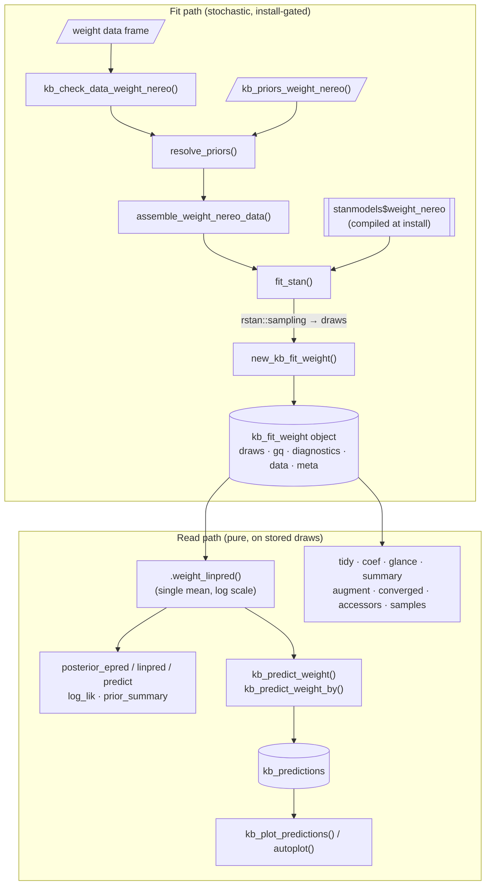

# kelpbio Architecture

> Scope: the package as it stands on the `add-weight-model` branch. One model, the *Nereocystis luetkeana* allometric weight model, is implemented end to end. This document describes the architecture that model establishes and that every later model will reuse. The behavioural contract lives in `openspec/specs/`; the rationale behind the choices below lives in the other files in `decisions/`. Read those for authority; read this for the map.

## Overview

kelpbio fits Bayesian hierarchical kelp-biomass models with Stan and exposes them through a small S3 surface built on the tidyverse/`posterior` stack. The engine is `rstan` + `rstantools`: Stan sources in `inst/stan/` are transpiled to C++ and compiled into the package binary at `R CMD INSTALL` time, so users never need `cmdstanr` or a separate Stan toolchain. See `decisions/engine-choice.md`.

The package is designed around one organising decision: a fit object stores **extracted posterior draws, not the live `stanfit`**. Fitting is the only stochastic step; everything downstream (summaries, diagnostics, predictions, plots) is pure `posterior` arithmetic over stored draws. This makes fit objects small, portable, robust across rstan versions, and makes a pre-fit model a non-special case (the bundled `fit_weight_sim_nereo` is just a fit object). See `decisions/prediction-engine.md` and the `fitting` spec.

The eventual package composes six sub-models (weight, size, density, blade fraction, wet/dry, carbon) into a biomass estimate by size-integration. On this branch only the weight model exists; the other five and the biomass composition are out of scope. The architecture here is deliberately the template the rest will follow.

## Architecture Diagram

The two halves meet only at the fit object. The fit path runs `rstan::sampling()` once and discards the `stanfit`; the read path never touches Stan.

## The Stan Engine

**Purpose**: define the likelihood and priors; compile to a callable model object.

**Location**: `inst/stan/weight_nereo.stan`, surfaced as `stanmodels$weight_nereo` (`R/stanmodels.R`, generated).

**Why rstan / rstantools, pre-compiled.** kelpbio uses the `rstan` + `rstantools` backend so the Stan models are transpiled to C++ and compiled once when the package is installed, not when a user fits. Fitting is then an ordinary function call against the ready binary: no cmdstan toolchain, no C++ compiler invoked at runtime, and no minutes-long per-model compile. Users get a package that installs like any other and runs immediately. Because the model is fixed at compile time, everything a user might want to vary (the prior hyperparameters and the structural flags below) is passed in through the Stan `data` block rather than by editing and recompiling source, so the single compiled binary serves every prior choice and structural variant. See `decisions/engine-choice.md`.

The model is the validated analysis-project allometry adapted to site-year resolution (no month dimension). `log(weight)` follows a Student-t (df fixed at 4) with mean

- intercept + linear + quadratic terms in centered log-diameter,
- a site random intercept and a site random slope on log-diameter,
- a site:year random intercept.

Engine conventions visible in the source (see `openspec/config.yaml` `context:` for the cross-cutting rules):

- **Priors as data.** Every prior hyperparameter is a `data`-block input (`prior_intercept_mu`, `prior_sd_site_rate`, and so on), so users adjust priors through R without recompiling. The prior *family* is fixed at compile time (Normal for location terms, Exponential for SDs).
- **Non-centered parameterization.** `z_*` standard-normal parameters scaled by the group SD in `transformed parameters` (`z_bSite` -\> `bSite`, etc.).
- **Structural flags as data.** `prior_only` skips the likelihood (sample from priors); `site_year_on` zeroes the site:year term. Both let one compiled model serve several structural variants. `site_year_on` is not a user argument: the fitting layer derives it from the data (dropped only when fewer than two years are present, kept otherwise, with a warning when the design is aliased); see the fitting layer and `openspec/specs/fitting`.
- **`nObs == 0` supported** for prior-only / empty fits; likelihood and generated- quantity loops are no-ops.
- **Log-diameter centered at `diameter_ref`** (a data input; the geometric mean of observed diameter). Centering in log space makes the diameter unit immaterial, so the fit and predictions are scale-invariant and the data columns keep plain names.
- **Mean defined once** in `transformed parameters` (`log_eWeight`) and reused by the `generated quantities`: `log_lik` (pointwise, for `loo`) and `yrep` (response-scale replicate, for `pp_check`). Predictions at new data are computed in R, not here.

Because `devtools::load_all()` does not re-transpile Stan, any `.stan` edit requires `rstantools::rstan_config()` then `devtools::install()`. See `CLAUDE.md`.

## Fitting Layer

**Purpose**: turn a data frame into a fit object; isolate the one stochastic step.

**Entry point**: `kb_fit_weight_nereo()` in `R/kb_fit_weight_nereo.R`.

The fit function is deliberately a thin orchestrator over pure helpers plus one sampling call, so almost all logic is unit-testable without MCMC (see Testability):

1.  `.chk_sampler_args()` / `kb_check_data_weight_nereo()` validate arguments and data.
2.  `resolve_priors(priors, kb_priors_weight_nereo())` merges user priors over defaults (`R/resolve_priors.R`): `NULL` returns defaults; supplied names must be a subset of the defaults; each entry must match the default's family (family is fixed).
3.  `assemble_weight_nereo_data()` maps validated data plus the resolved prior list to the Stan `data` block (`R/assemble_weight_nereo_data.R`): factor-codes `site`/`year` to integers, passes raw `diameter`/`weight` (Stan applies the log transforms), computes `diameter_ref` via `weight_diameter_ref()`.
4.  `fit_stan()` (`R/fit_stan.R`) is the model- and species-agnostic sampling engine shared by every future `kb_fit_*`: it calls `rstan::sampling()` once, extracts draws with `posterior::as_draws_rvars()`, splits the requested parameters from the generated quantities (`gq_vars`), summarises convergence (Rhat, bulk/tail ESS, divergences), captures the Stan source, and lets the `stanfit` go out of scope.
5.  `new_kb_fit_weight()` assembles the fit object and its metadata.

**Sampler conventions** (all in `kb_fit_weight_nereo()` / `fit_stan()`):

- `niters` means *saved post-warmup draws per chain*. `fit_stan()` sets `warmup = niters` and `iter = warmup + niters * nthin`, so the argument does not collide with rstan's own `iter` semantics.
- `adapt_delta = 0.95` by default (above Stan's 0.8, for the hierarchical geometry), merged with any user `control` list passed through `...` so it stays overridable.
- `quiet = FALSE` shows sampling progress and rstan's full HMC diagnostics; `quiet = TRUE` muffles the post-sampling diagnostic warnings locally via `with_quiet_sampler()` (a `withCallingHandlers`), never a global option.
- `resolve_cores()` respects `getOption("mc.cores")`, falling back to `chains`, capped at available cores so the default never oversubscribes.

**The fit object**. `new_kb_fit_weight()` returns `class = c("kb_fit_weight_<species>", "kb_fit_weight", "kb_fit")` with:

| Slot | Contents |
|---------------------------|---------------------------------------------|
| `draws` | `posterior` `draws_rvars` of the model parameters (fixed effects, SDs, and the per-level `bSite`/`bSiteDiameter`/`bSiteYear`, kept so predictions and `augment` can condition on observed levels). |
| `gq` | `log_lik` and `yrep` generated-quantity draws (`NULL` for zero-row fits). |
| `diagnostics` | `summary` (per-variable Rhat/ESS) plus the run-level `ndivergent`, `perc_divergent`, `perc_max_treedepth` and `ebfmi`, as plain numerics. Computed while the `stanfit` is in scope, since none can be recovered from the stored draws. |
| `data` | the validated input data frame. |
| `meta` | `species`, `prior_only`, `priors`, `stancode`, `site_levels`, `year_levels`, `nthin`, `diameter_ref`, `site_year_on` (auto-derived from the data), `nu`. |

Each species is a subclass of the model class (`c("kb_fit_weight_<species>", "kb_fit_weight", "kb_fit")`); species-agnostic methods live on the `kb_fit_weight` parent and are inherited, while species-varying kernels are subclass methods of small internal generics, so no method branches on `meta$species` (kept for display, with species-specific values entering through `meta_extra`). See `decisions/species-as-variant.md`.

## The Prediction Engine

**Purpose**: compute every predicted / derived quantity from stored draws, with the mean defined in exactly one R location.

**Single source of the mean**: the `.weight_linpred()` internal generic (methods `.weight_linpred.kb_fit_weight_nereo` in `R/weight_nereo_linpred.R`, `.weight_linpred.kb_fit_weight_macro` in `R/weight_macro_linpred.R`), returning a `posterior` `rvar` on the log scale over grid rows. Every prediction path routes through it, dispatching on the fit subclass, so each species' mean formula lives in exactly two places: the Stan `transformed parameters` and its `.weight_linpred` method.

**Per-row level resolution** is the heart of the engine. For each grid row the helper resolves the site intercept, site slope, and site:year effects independently:

- Known levels take their estimated per-level draws (`resolve_re1` / `resolve_re2`).
- Unknown or absent levels follow `new_levels`: `"sample"` draws a fresh effect from its estimated SD (`re_draw()` via `posterior::rvar_rng`), widening the interval to include between-group variation; `"average"` holds the effect at zero.
- `representative_site` is a third treatment for a *new* site: borrow the per-draw average intercept/slope of one or more named reference sites instead of following `new_levels`. See `decisions/prediction-engine.md` and the `add-representative-site` change.

**Two user-facing verbs** with independent arguments (the split is the current contract; `kb_predict_weight()` takes no `by`):

| Verb | File | Grid | Use |
|------------------|------------------|------------------|------------------|
| `kb_predict_weight()` | `R/kb_predict_weight.R` | the supplied `new_data` rows, or the observed data when `new_data = NULL` (matching base `predict()`) | prediction at specific rows; per-row level resolution |
| `kb_predict_weight_by()` | `R/kb_predict_weight_by.R` | a generated diameter sequence crossed with the `by` factors (`NULL`, `"site"`, or `c("site","year")`) | allometric curves, one per group, ready to plot |

`by = "year"` is rejected (`validate_by_weight()`): year has no main effect, only the site:year interaction. `build_by_grid()` crosses diameter only with *observed* site:year combinations. Both verbs share `summarise_weight_predictions()`, which exponentiates the log-scale rvar, reduces each row to `estimate`/`lower`/`upper` (the `estimate` function plus equal-tailed `conf_level` limits, `signif`-rounded), and wraps the result as a `kb_predictions` object.

**`rstantools` generics** (`R/posterior_epred.R`, `posterior_linpred.R`, `posterior_predict.R`, `log_lik.R`, `predict.R`, `prior_summary.R`) are thin faces over the same helper, returning a draws-by-observations (`D x N`) matrix rather than a summary: `posterior_linpred` is the raw linpred, `posterior_epred` exponentiates, `posterior_predict` adds Student-t noise (and returns stored `yrep` when `new_data = NULL`), `log_lik` returns the stored pointwise matrix (feeds `loo::loo`). `predict.kb_fit_weight` wraps `kb_predict_weight`.

## Summary and Diagnostic Surface

**Purpose**: report parameters and fit quality through familiar generics, reconstructed from the stored draws.

kelpbio implements methods for generics owned by `generics` (`tidy`/`glance`/`augment`), `stats` (`coef`/`predict`/`fitted`/`residuals`/`nobs`), `base` (`summary`/`print`), `universals` (`converged`/`rhat`/`esr`/`estimates`/`npars`/`nterms`/`nchains`/`niters`/ `pars`), `rstantools` (the prediction generics + `prior_summary`), and `ggplot2` (`autoplot`), plus its own `samples()` and `kb_stancode()`. The re-exports live in `R/generics.R` / `R/kelpbio-package.R`; the full inventory is in `decisions/prediction-engine.md`.

The `generics` contract is shape-only, so output uses Poisson house vocabulary rather than broom's glossary: `tidy()`/`coef()` return `term`/`estimate`/`lower`/`upper` (`R/tidy.R`, `R/coef.R`); `coef` is a pure wrapper on `tidy`; `glance` returns bboutools-style columns (`R/glance.R`). Point estimates come from the `estimate` function (median by default) and intervals from equal-tailed `conf_level` limits. `include_random_effects` defaults to `FALSE` (report the SD hyperparameters, not the per-level deviations), following `broom.mixed`.

`summary.kb_fit` (`R/summary.R`) returns a classed `summary_kb_fit` combining a metadata header and the coefficient table augmented with `rhat`/`ess_bulk`/`ess_tail` from the stored diagnostics (same source as `converged()`/`glance()`, so numbers agree). `fit_descriptor()` supplies the model-specific header (likelihood family, effect structure in prose, group counts, centering reference); it switches on the fit subclass and returns `NA` fields for unknown models, so new models slot in by adding a `switch` branch. The header prose deliberately avoids a mixed-model formula so the output implies no formula interface.

`converged()` (`R/converged.R`) and `glance()` assess convergence on three conditions: Rhat, the bulk effective sample *rate* (`esr` = `ess_bulk / ndraws`), and the divergent-transition rate, with defaults `rhat = 1.01` (the Vehtari et al. 2021 recommendation for the rank-normalized statistic `posterior::rhat()` computes), `esr = 0.1`, and `max_perc_divergent = 0.2`. Divergences gate the verdict because they signal the sampler failed to explore part of the posterior; treedepth saturation and E-BFMI are reported by `print(summary())` but do not gate it. `glance()` carries `perc_divergent` only, keeping the one-row summary narrow enough for a report table. Structural accessors (`R/accessors.R`) all read from `x$draws` / `x$diagnostics` via `posterior`. `augment()` (`R/augment.R`) returns the data with `fitted`/`residual` computed through the same linpred helper, so its central estimate agrees with `posterior_epred(new_data = NULL)`.

## Objects and Metadata

**`kb_fit` / `kb_fit_weight`** — the draws-not-stanfit fit object (slots above). Accessed with `$` (`x$draws`, `x$meta`); `samples(fit)` returns a `posterior` `draws_rvars`. Constructed only internally by `new_kb_fit_weight()`.

**`kb_predictions`** (`R/kb_predictions.R`) — a tibble subclass carrying column-role metadata as attributes: `kb_predictor`, `kb_predictor_units`, `kb_group_vars`, `kb_response`, `kb_response_units`, and `kb_curve` (whether rows form an ordered generated grid, hence ribbon-eligible; not recoverable from the data shape). `kb_plot_predictions()` (`R/kb_plot_predictions.R`) resolves its `x`/`style`/`facet` defaults from these attributes and falls back with a helpful error if a dplyr verb has stripped them; `autoplot.kb_predictions()` (`R/autoplot.R`) is the conventional entry point and dispatches on the prediction data frame, never on a fit.

**Prior objects** — `kb_prior_normal()` / `kb_prior_exponential()` (`R/kb_prior_normal.R`, `R/kb_prior_exponential.R`) are tiny self-validating, self-printing tagged lists (`class = c("kb_prior_normal", "kb_prior")`, etc.); `kb_priors_weight_nereo()` (`R/kb_priors_weight_nereo.R`) returns the named default list (seven entries: `intercept`, `diameter`, `diameter2`, `sd_site`, `sd_site_diameter`, `sd_site_year`, `sd_residual`).

## Testability Design

The layering exists to make MCMC-free testing the norm; see `decisions/bboutools-api-review.md`.

- **Layer 1 (pure, always run).** Data validation, prior resolution, and Stan-data assembly are pure functions unit-tested without sampling. Bespoke validators follow the `.vld_` (pure predicate) / `.chk_` (messaging) split in `R/vld.R` / `R/chk.R`.
- **Layer 2 (fixture, always run).** Every downstream method is tested against small pre-built fits in `tests/testthat/fixtures/` (built with `rstan::sampling(seed=)`), loaded via `helper-fixtures.R`. Tests assert structure and invariants (for example `lower <= estimate <= upper`, `weight > 0`, wider `conf_level` gives wider intervals, `"sample"` intervals no narrower than `"average"`), snapshot only prints and messages, and never snapshot MCMC numerics.
- **Layer 3 (install-gated, `skip_on_cran`).** A few end-to-end tests exercise the one `rstan::sampling()` line and assert the returned object's shape.

Tests mirror sources 1:1 (`R/<name>.R` \<-\> `tests/testthat/test-<name>.R`).

## Code References

| Component | File | Key symbols |
|-------------------------|-----------------|------------------------------|
| Stan model | `inst/stan/weight_nereo.stan` | `log_eWeight`, `log_lik`, `yrep`, `prior_only`, `site_year_on`, `diameter_ref` |
| Compiled model object | `R/stanmodels.R` (generated) | `stanmodels$weight_nereo` |
| Fit entry point | `R/kb_fit_weight_nereo.R` | `kb_fit_weight_nereo()`, `new_kb_fit_weight()` |
| Sampling engine | `R/fit_stan.R` | `fit_stan()`, `with_quiet_sampler()`, `resolve_cores()` |
| Data validation | `R/kb_check_data_weight_nereo.R`, `R/vld.R`, `R/chk.R` | `kb_check_data_weight_nereo()`, `.vld_*`, `.chk_*` |
| Prior resolution | `R/resolve_priors.R` | `resolve_priors()` |
| Stan-data assembly | `R/assemble_weight_nereo_data.R` | `assemble_weight_nereo_data()`, `weight_diameter_ref()` |
| Prior objects | `R/kb_prior_normal.R`, `R/kb_prior_exponential.R`, `R/kb_priors_weight_nereo.R` | `kb_prior_normal()`, `kb_prior_exponential()`, `kb_priors_weight_nereo()` |
| Mean helper | `R/weight_nereo_linpred.R` | `.weight_linpred()`, `resolve_re1()`, `resolve_re2()`, `re_draw()`, `validate_by_weight()`, `build_by_grid()` |
| Prediction verbs | `R/kb_predict_weight.R`, `R/kb_predict_weight_by.R` | `kb_predict_weight()`, `kb_predict_weight_by()`, `summarise_weight_predictions()` |
| rstantools generics | `R/posterior_epred.R`, `R/posterior_linpred.R`, `R/posterior_predict.R`, `R/log_lik.R`, `R/predict.R`, `R/prior_summary.R` | `posterior_epred.kb_fit_weight()`, `log_lik.kb_fit()`, etc. |
| Predictions object | `R/kb_predictions.R` | `new_kb_predictions()`, `print.kb_predictions()` |
| Plotting | `R/kb_plot_predictions.R`, `R/autoplot.R` | `kb_plot_predictions()`, `autoplot.kb_predictions()` |
| Parameter summaries | `R/tidy.R`, `R/coef.R`, `R/glance.R`, `R/summary.R`, `R/summarise.R` | `tidy.kb_fit_weight()`, `summary.kb_fit()`, `fit_descriptor()`, `summarise_draws_terms()` |
| Diagnostics / accessors | `R/converged.R`, `R/accessors.R`, `R/samples.R`, `R/kb_stancode.R` | `converged.kb_fit()`, `esr.kb_fit()`, `rhat.kb_fit()` |
| Augment | `R/augment.R` | `augment.kb_fit()` |
| Generic re-exports | `R/generics.R`, `R/kelpbio-package.R` | re-exported `generics`/`universals`/`rstantools`/`ggplot2` generics |
| Bundled data / fit | `data/`, `data-raw/` | `data_weight_sim_nereo`, `fit_weight_sim_nereo` |

## Glossary

| Term | Definition |
|------------------------|-----------------------------------------------|
| draws-not-stanfit | The fit object stores extracted posterior draws, not the live `stanfit`; the `stanfit` is discarded after fitting. |
| linpred | Linear predictor: the model mean on the log scale, returned as a `posterior` `rvar` by `.weight_linpred()`. |
| `new_levels` | How predictions treat a grouping level not conditioned on: `"sample"` draws a random effect from its estimated SD; `"average"` holds it at zero. |
| `representative_site` | Predict a new site by borrowing the intercept/slope of named reference sites (per-draw average), instead of `new_levels`. |
| `by` | The grouping factors that each get their own predicted curve in `kb_predict_weight_by()`; valid values `NULL`, `"site"`, `c("site","year")`. |
| `diameter_ref` | Geometric mean of observed diameter; the log-diameter centering reference, shared by the Stan fit and R predictions. |
| `esr` | Effective sample rate: bulk ESS divided by number of draws; used with Rhat for the convergence verdict. |
| `prior_only` | Structural flag that skips the likelihood so the model samples from the priors. |
| `site_year_on` | Structural flag gating the site:year random effect, derived from the data (not user-set): off when fewer than two years are present, on otherwise; on with a warning when the design is aliased (no site sampled in more than one year). |
| gq | Generated quantities (`log_lik`, `yrep`) stored separately from the model parameter draws. |
| site-year resolution | The kelpbio models drop the analysis project's month dimension, working at site-year granularity. |