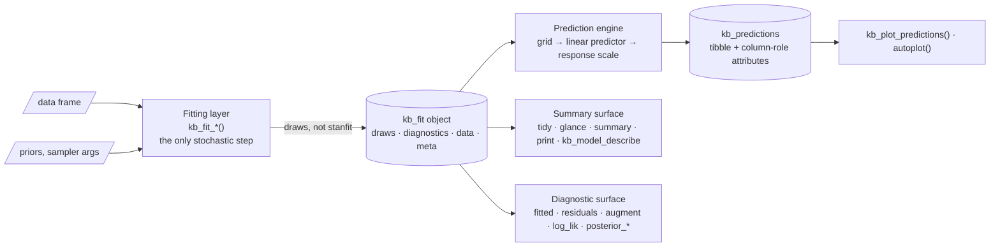

# kelpbio Architecture

> The durable shape of the package and the rules that decide where new code goes.
> Behaviour lives in `openspec/specs/`; the other files in `decisions/` hold the
> rationale for specific choices. For a detailed map of the current internals,
> generate one from the code (the `describe-design` skill does this) rather than
> maintaining it here.

## Overview

kelpbio fits Bayesian hierarchical kelp-biomass models with Stan and exposes them
through a small S3 surface built on the tidyverse and `posterior`. Stan sources in
`inst/stan/` are compiled into the package binary at `R CMD INSTALL`, so users need
no Stan toolchain (`decisions/engine-choice.md`).

The organising decision is that a fit object stores **extracted posterior draws,
not the live `stanfit`**. Fitting is the only stochastic step; everything
downstream (summaries, diagnostics, predictions, plots) is `posterior` arithmetic
over stored draws. Fit objects are therefore small, portable, robust across rstan
versions, and a pre-fit model is not a special case (`decisions/prediction-engine.md`).

The package will compose six sub-models (weight, size, density, blade fraction,
wet/dry, carbon) into a biomass estimate by size integration. The weight models for
*Nereocystis luetkeana* and *Macrocystis pyrifera* set the pattern the others
follow.

```mermaid
flowchart LR
    D[/"data frame"/] --> FIT
    P[/"priors, sampler args"/] --> FIT
    FIT["Fitting layer<br/>kb_fit_*()<br/>the only stochastic step"]
    FIT -->|"draws, not stanfit"| OBJ[("kb_fit object<br/>draws · diagnostics · data · meta")]
    OBJ --> PRED["Prediction engine<br/>grid → linear predictor → response scale"]
    OBJ --> SUMM["Summary surface<br/>tidy · glance · summary · print · kb_model_describe"]
    OBJ --> DIAG["Diagnostic surface<br/>fitted · residuals · augment · log_lik · posterior_*"]
    PRED --> KP[("kb_predictions<br/>tibble + column-role attributes")]
    KP --> PLOT["kb_plot_predictions() · autoplot()"]
```

Everything to the right of the fit object reads stored draws and metadata and never
re-enters Stan. That boundary is what makes the whole surface testable without
MCMC and makes a pre-fit model behave exactly like a fresh one.

## Layers

- **Fitting.** Each `kb_fit_<model>_<species>()` validates its inputs, derives the
  model structure from the data (which effects are fitted), assembles the Stan data
  list with priors as data, samples through one shared engine, and builds the fit
  object. The structure is decided by pure helpers, so it is tested without MCMC.
- **Prediction.** Both prediction verbs and the `posterior_*()` generics resolve a
  grid of rows to one linear predictor (per-row random-effect and covariate
  resolution), then map it to the response scale. The mean is defined once per
  model, in R, mirroring the Stan file.
- **Summaries.** Parameter summaries, diagnostics, and print output read the stored
  draws and diagnostics; the model description is rendered from the fit's stored
  priors and structure.

## Why the Nereocystis likelihood is Normal on log weight

Biomass averages expected weight over the size distribution. Under a Student-t on
log weight, `E[weight]` does not exist, so the integration would have nothing to
average. The Normal gives the expected weight `exp(mu + sWeight^2 / 2)`.

## Offsets

A rate model's survey effort enters as an offset taken from the grid, so what a
prediction reports is fixed by the rows it was given: supplied rows carry the effort
actually recorded, while a generated grid takes one neutral unit, so a `_by` verb
reports a rate and a row-wise verb reports the response as modelled. No argument
selects between them (`decisions/prediction-engine.md`). The density models carry
the offset (`area_m2`); weight and size have none.

## Random-effect resolution

A known level conditions on its estimated effect regardless of `new_levels`; only an
unknown or absent level consults it. That lets a mix of observed and new groups
resolve in one call. Optional covariates follow the same idea: a row's own value,
then a value recorded at fit time, then a neutral default.

## Meta Versus Dispatch

Every per-model fact is either a value stored in `meta` at fit time or an internal
generic dispatching on the fit subclass. The rule, applied in order:

1.  **Can it be computed at fit time and frozen?** A name, a level set, a scalar, a
    flag derived from the data or the call is a value. -> `meta`
2.  **Is the code that consumes it identical across models?** If every model runs
    the same lines and only a constant differs, there is nothing to dispatch on.
    -> `meta`
3.  **Otherwise** the arithmetic, the control flow, or the *explanation* differs.
    -> generic with a `.default` that aborts

A fact that dispatch already encodes is never also stored, unless something
displays it: `species` lives in both the class (for dispatch) and `meta` (for
printing), while `model` is not duplicated because nothing displays it and a second
copy could disagree with the class.

Within `meta`, a fact every sub-model must declare is a required argument of the fit
constructor (`offset`, `terms`), so omitting it fails at fit time; a fact only some
models have travels in `meta_extra`. The declarations are not validated at runtime:
the constructor is internal and every caller is one of the package's own fit
functions, so a malformed declaration is an authoring error that tests catch.

### Internal generics fail loudly

The public method bodies live on `kb_fit` and delegate what varies to internal
generics. Because those methods accept any `kb_fit`, each internal generic has a
`.default` that aborts, so a sub-model added without its methods errors rather than
computing a wrong number. The one exception supplies `print()`'s header fields,
where a missing method degrades a display rather than a number; its default returns
absent fields. `tests/testthat/test-abort.R` discovers the generics from the
namespace and pins both sets, so a new generic in neither set fails the test. The
abort message names only the object's class and the `kb_fit_*()` pattern: one
internal generic serves several public verbs, so naming it would describe something
the user never called.
